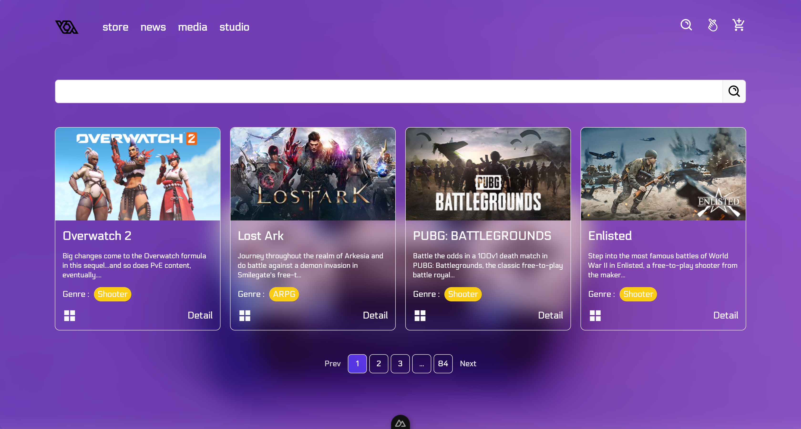
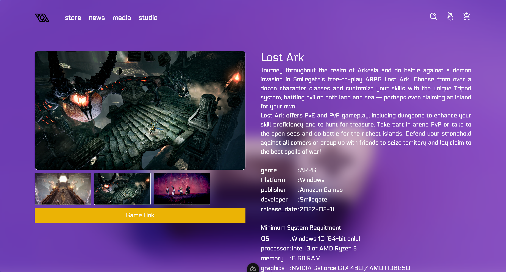
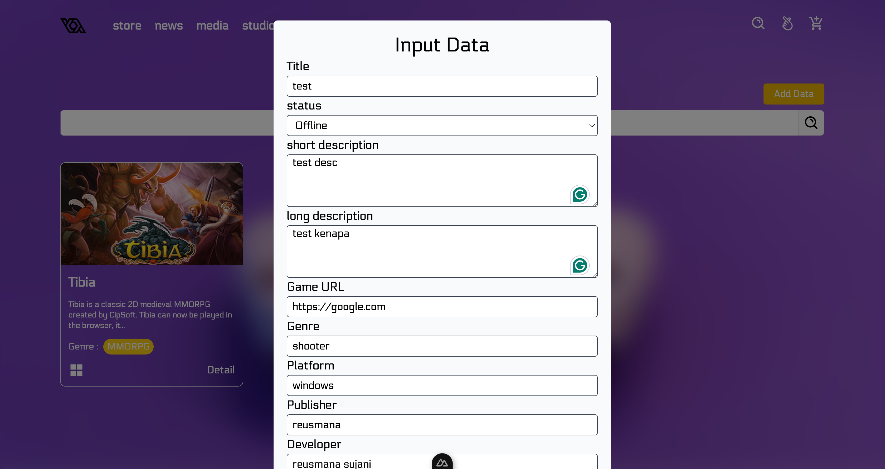
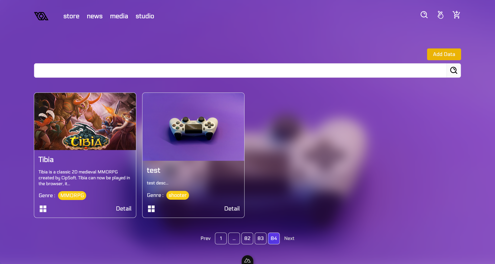
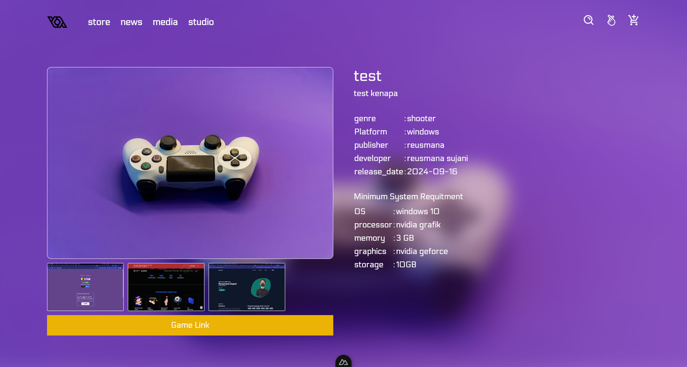
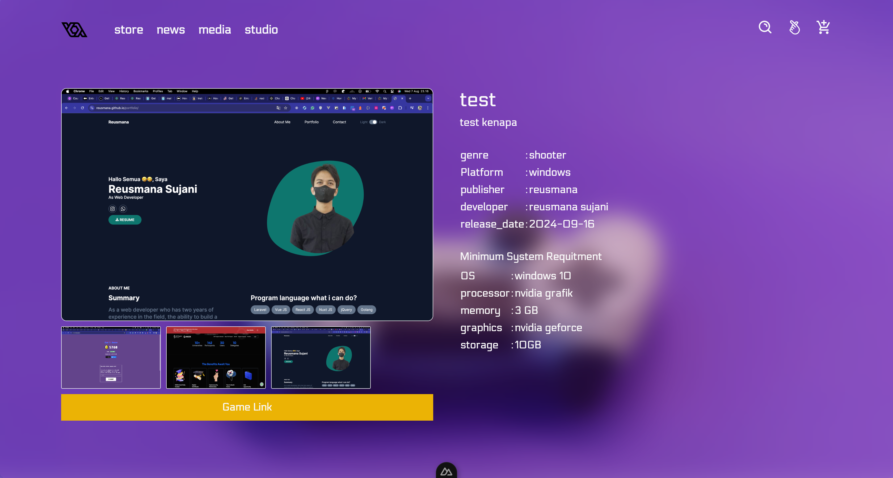

Start the development server on `http://localhost:3000`:

```bash
# npm
npm run dev

```

this is homepage


when you click button play or buy now, will be redirect to page list game


then when you click detail inside card one of list a games, will be redirect to detail pages information


this is for Create Data but not saved to db and api, just add to json




